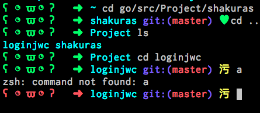

## Gopher Zsh Theme
---
### Screenshot



### Usage

### STEP 1
```shell
 $ git clone git@github.com:scbizu/gopher.git ~/.oh-my-zsh/custom/themes/
```
### STEP2

Edit `~/.zshrc` file,and set the `ZSH_THEME` :
```
  ZSH_THEME="gopher/gopher"
```

Then enjoy it :)
